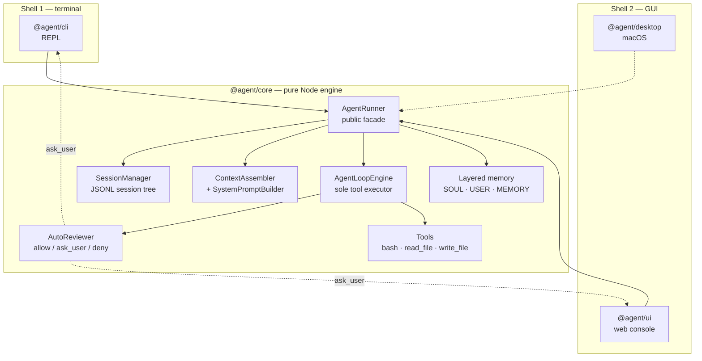

# SuperIU

[](https://github.com/Kayphoon/SuperIU/actions/workflows/ci.yml) [](LICENSE)

**One Core, Two Shells** — an autonomous coding agent built as a pure engine plus thin, swappable user interfaces.

The core knows nothing about terminals, colours, or GUIs. Every shell is a client of the same engine, so behaviour, session state, and safety policy are identical no matter where you drive it from. "Two shells" means two *presentation* families — the terminal, and the GUI (the web console and the macOS app).

| Layer | Package | Role |
| --- | --- | --- |
| Core | `@agent/core` | Session tree, context assembly, unbounded agent loop, tool execution, memory, review, emotion |
| Shell 1 | `@agent/cli` | Terminal REPL with streaming output and an interactive approval gate |
| Shell 2 | `@agent/ui` | Local web console — serves a browser SPA over HTTP |
| Shell 2 | `@agent/desktop` | macOS native shell, same GUI family — wraps `@agent/ui` in an Electron window |

## Quickstart

```bash
pnpm install
pnpm build
cp .env.example .env      # then fill in your credentials
```

`.env` is loaded by `@agent/core` via `dotenv` when the runner is constructed, so every shell reads the same configuration.

Launch a shell:

```bash
pnpm cli        # terminal REPL
pnpm ui         # local web console, http://127.0.0.1:3000
pnpm desktop    # macOS native shell (needs a graphical session)
pnpm app:install  # build + install SuperIU.app into ~/Applications (macOS)
pnpm app:zip    # build + write a distributable .zip instead of installing
pnpm test       # smoke suite + UI localization guard + cross-dictionary parity guard + provider credential wire guard
```

Type-checking without emitting:

```bash
pnpm typecheck  # type-check all @agent/* packages
```

> `pnpm desktop` launches the macOS shell, which embeds the same web console in an Electron window. It requires a graphical session — it cannot run headless. See [Architecture at a glance](#architecture-at-a-glance).

### Installing SuperIU as a macOS app

`pnpm desktop` is a development runner — it boots the Electron framework's own bundle, which is named "Electron", so Spotlight (聚焦搜索) cannot find it. To install SuperIU as a first-class application:

```bash
pnpm app:install
```

This builds `SuperIU.app` (own bundle identifier `com.superiu.desktop`, own icon, self-contained runtime) and installs it to `~/Applications`, then registers it with LaunchServices and Spotlight. Afterwards:

```bash
open -a SuperIU                # or: open -b com.superiu.desktop
```

…and ⌘+Space → `SuperIU` → Enter works too. Re-run `pnpm app:install` after changing source. Full details, including how the bundle is assembled, are in the [shells guide](docs/shells-guide.md#installing-as-a-real-macos-app).

## Configuration

All configuration is environment-driven. Copy `.env.example` to `.env` and set:

| Variable | Default | Purpose |
| --- | --- | --- |
| `OPENAI_API_KEY` | `placeholder-key` | Credential for the model endpoint. |
| `OPENAI_BASE_URL` | SDK default | Any OpenAI-compatible endpoint (DeepSeek, SiliconFlow, Ollama, Moonshot…). |
| `OPENAI_MODEL_NAME` | `gpt-4o` | Main agent model that drives the loop. |
| `OPENAI_REVIEW_MODEL_NAME` | `OPENAI_MODEL_NAME`, else `gpt-4o-mini` | Model used for AutoReview arbitration. Typically cheaper; resolved independently of the main model. |
| `OPENAI_REASONING_EFFORT` | `medium` | `low`, `medium`, or `high` reasoning effort for thinking models; also scales the output token budget (2048 / 4096 / 8192, capped 16384). Applied only to models that accept the parameter; anything else is ignored. |
| `SUPERIU_AUTO_REVIEW` | `1` (on) | Set to `0` to disable the automatic approval gate entirely. |
| `SUPERIU_AUTO_REVIEW_MODE` | `lenient` | `lenient` or `strict`. Anything other than `strict` resolves to `lenient`. |
| `PORT` | `3000` | Port for the web console (`@agent/ui` only). |
| `HOST` | `127.0.0.1` | Bind address for the web console (`@agent/ui` only). |
| `SUPERIU_LANGUAGE` | `zh` | Interface language: `zh` or `en`. Seeds the default only — a `language` in the settings file wins over it. An unsupported value is ignored, falling back to the file and then to `zh`. |

The web console additionally persists the same settings to `.myagent/ui-settings.json` so they can be edited from the Settings dialog (⌘,) without touching `.env`. Environment variables seed the defaults; the settings file wins once written. The interface language and the **appearance** (System / Dark / Light) are among those settings and can both be switched at runtime from the same dialog — see [Interface language](docs/shells-guide.md#interface-language) and [Appearance](docs/shells-guide.md#appearance).

That dialog's **Model Configuration** pane manages providers rather than bare credential fields: each provider carries its own name, API key, Base URL, and model list, and exactly one is active — its key and Base URL are what the runner uses. Each provider keeps its own credential, so switching to one with no key of its own leaves the app unconfigured instead of sending the previous provider's key to a different endpoint. **Fetch models** probes the endpoint's live `GET /models` listing (`POST /api/models/fetch`), which resolves a stored key by endpoint, so no provider's credential is ever sent to another provider's host. A stored key is never sent back to the browser — leaving the field blank keeps it. Credentials remain in the same 0600 settings file.

## Architecture at a glance



Shells depend on the core; the core never depends on a shell.

| Package | Responsibilities |
| --- | --- |
| `@agent/core` | JSONL session tree, context assembly, the unbounded loop, exclusive tool execution, three-tier memory, AutoReview, skills, emotion. |
| `@agent/cli` | Readline REPL, streaming output, two-level Ctrl+C interruption, slash commands, terminal `y/N` approval card (defaults to deny). |
| `@agent/ui` | Static SPA plus a small HTTP/SSE server that streams agent turns and exposes settings. |
| `@agent/desktop` | macOS native shell. Electron main process that embeds `@agent/ui` in-process, with a native application menu, window chrome, and notifications. |

For the full design — session storage internals, context compaction, prompt-cache layout, review evidence rules — see [`docs/agent-loop-and-context-architecture.md`](docs/agent-loop-and-context-architecture.md).

## Key capabilities

### Unbounded agent loop with exclusive tool authority

`AgentLoopEngine` is the only component that ever executes a tool. Before calling the model the adapter strips every tool's `execute` property, so the SDK can only ever *produce* `tool-call` parts. The loop runs `while (stepIndex < maxSteps)` with `maxSteps` defaulting to `Infinity`, and converges naturally when the model stops requesting tools. Each iteration re-assembles context rather than computing it once per session.

A throwing tool is caught, formatted as `[Tool Error in X]: <message>`, and fed back with `isError: true` so the model can self-correct instead of the turn dying.

### JSONL session tree, `leafId`, and the `/clear` boundary

Sessions are append-only JSONL trees at `<workspace>/.myagent/sessions/<encoded-cwd>/<timestamp>_<sessionId>.jsonl`. Each entry carries `id` / `parentId` / `timestamp`; every append parents to the current mutable `leafId` pointer, so branching moves the pointer without rewriting history.

`buildSessionContext(leafId)` walks back to the root, reverses to chronological order, truncates at the most recent `reset_boundary`, and drops dangling tool calls and orphaned tool results. `/clear` appends a `reset_boundary` entry — a hard truncation boundary rather than a deletion, so the prior branch stays on disk and remains resumable.

Prompt history lives in a separate `node:sqlite` database (`.myagent/history.db`) decoupled from the session tree, written *before* the loop runs so an interrupted prompt is still remembered.

### Three-tier AutoReview with an interactive approval gate

Every tool call is classified before execution:

- **`allow`** — zero-latency, never shown. Read-only work: `read_file`, `ls`, `pwd`, `git status|diff|log`, `cat`, `head`, `tail`, `echo`.
- **`ask_user`** — escalated to the approval card. Sensitive or mutating work: `rm -rf dist|build|node_modules`, `git clean -fd`, `git reset --hard`, package installs, `curl`, `sudo`, writes outside the workspace.
- **`deny`** — irreversible or malicious, never offered: `rm -rf /`, `mkfs`, `dd if=/of=`, fork bombs, credential exfiltration.

The deliberate boundary: ordinary development commands are never hard-blocked, at most escalated to `ask_user` for a human to release. When the rule engine returns no verdict the `reviewModelName` model arbitrates. If that review model errors, times out, or returns unparseable output, the call is **escalated to `ask_user`** — fail-to-human, never fail-open.

The host supplies a `permissionGate` to render the card. Returning `false` yields `[User Denied]: Execution rejected by user.`; a missing gate yields `[AutoReview Pending Approval]`; a throwing gate yields `Approval channel failed`. All three feed back as `isError: true` and the loop continues rather than terminating. Hosts must resolve pending approvals when a turn is interrupted, or the loop waits forever.

### `then_run`: fuse a write with its verification

`write_file` accepts an optional `then_run` command, collapsing a write and its verification into a single tool call instead of burning an extra loop iteration:

```
Successfully wrote 1234 bytes to src/foo.ts

[then_run: pnpm typecheck]
<bash output>
```

If the write itself fails, `then_run` is short-circuited and never runs. It shares `executeBashCommand()` with the `bash` tool, so process-group kill, timeout, spillover, and abort propagation behave identically.

### `.agents/skills` protocol with lazy loading

Skills follow the public Agent Skills standard: `.agents/skills/<name>/SKILL.md` with YAML frontmatter carrying `name` and `description`. Both a workspace root and a user-global root are scanned; a workspace skill shadows a same-name user skill, and results are sorted by name so the prompt stays stable.

Loading is lazy. The system prompt carries only each skill's name, a one-line summary, and its absolute path — the body is read on demand. Summaries collapse to a single line and are capped, because that block is rebuilt every iteration and would otherwise grow linearly with the number of installed skills.

In this repository `.agents/skills` is a symlink to `.wiki/skills`, so project knowledge modules are exposed to the agent as skills.

### Spillover circuit breaker

A single tool output exceeding 2000 characters is written to disk (`<memoryDir>/spillover/spillover-<timestamp>-<id>.log`, falling back to the workspace when the memory directory is not writable). The model receives only an 800-character head and 800-character tail preview plus a pointer to read the file directly, so one verbose log cannot blow out the context window.

### Prompt-cache prefix contract

The system prompt is assembled static-first, volatile-last:

```
engineering directives → SOUL → USER → MEMORY → <skills> → <workstation> → extra instructions → operational posture
```

Provider prompt caching is prefix-matched byte-for-byte from token 0, and `<workstation>` embeds a per-turn ISO timestamp. Placing it early would force a cache miss on *every* step of an unbounded loop. Keeping it late — with the timestamp deliberately on its final line — leaves the shared prefix intact across steps.

**Never move `<workstation>` or any timestamp-bearing block ahead of the static section.**

### Emotion and operational posture

A three-axis state machine tracks `valence` [-1, 1], `arousal` [0, 1], and `fatigue` [0, 1] around baselines `0.0` / `0.2` / `0.0`. It decays exponentially toward those baselines with a five-minute half-life (`fatigue` decays at double).

Interactions update it: tool success nudges `valence` up, failure pulls it down, and each step accrues `fatigue`. The resulting posture is injected as a prompt modifier — high fatigue asks for terse output, negative valence sharpens scrutiny of edge cases, high arousal encourages driving multi-step verification.

## Slash commands

Available in the CLI REPL (`packages/cli/src/index.ts`):

| Command | Effect |
| --- | --- |
| `/status` | State, session id, JSONL path, leaf id, branch length, emotion, models, approval mode, memory dir. |
| `/clear` | Append a `reset_boundary` and truncate the active context. |
| `/history [query]` | Show recent prompt history, optionally filtered. |
| `/sessions` | List JSONL sessions for this workspace. |
| `/load <session-id\|file-name\|path>` | Load a session by reference. |
| `/new [title]` | Start a fresh JSONL session. |
| `/help` | Display the command list. |
| `/exit`, `/quit` | Close the runner and exit. |

The web console exposes a subset through its command palette (⌘K) and the composer's slash autocomplete (type `/`): `/clear`, `/status`, and `/sessions`.
