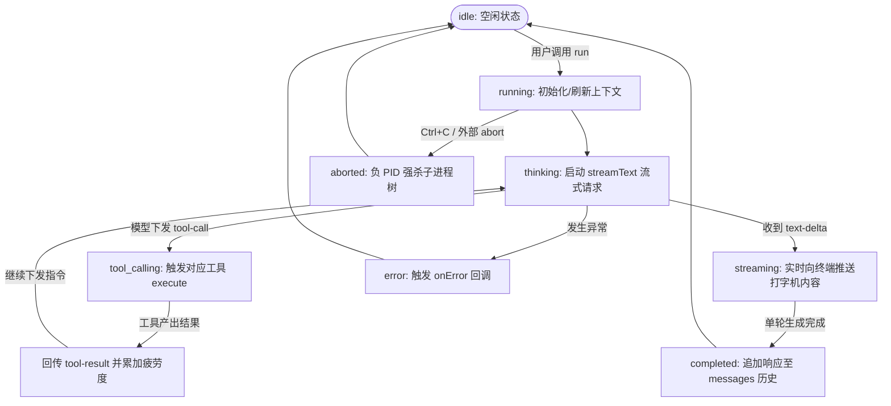

# SuperIU Agent Core 运行机制、系统提示词与工具生态规范

本文档详述当前 Agent 的执行循环（Agent Loop）、系统提示词合成来源（System Prompt）、以及内置工具集（Tools Inventory）。

---

## 1. Agent Loop 运行机制

当前的 Agent Loop 由 `@agent/core` 的 `AgentRunner` 类（`packages/core/src/runner.ts`）编排驱动，核心基于 **Vercel AI SDK 的 `streamText` 多步自主循环（Multi-step Autonomous Loop）** 与 **显式状态机（Explicit State Machine）**。

### 1.1 执行流程与状态流转

### 1.2 循环关键细节
1. **多步执行 (`maxSteps: 10`)**:
   - 当大模型决定调用工具时，`streamText` 触发 `tool-call`，调用我们在 `createTools` 中注册的原生工具。
   - 工具执行完毕后，执行结果被封装为 `tool-result` 自动追加至会话轮次，SDK 自动拉起下一轮模型思考，直到模型得出最终结论或达到 `maxSteps` 上限。
2. **异步流式消费 (`stream.fullStream`)**:
   - 采用 `for await (const part of stream.fullStream)` 异步迭代器实时捕获增量事件。
   - `text-delta` 即时通过 `onChunk` 推送终端打字；
   - `tool-call` 与 `tool-result` 触发外部可视化指示器，并计算工具执行耗时。
3. **两级信号打断 (Abort Controller)**:
   - 每次 `run()` 创建独立的 `AbortController`，并将 `signal` 下发给 `streamText` 和所有工具。
   - 外部调用 `abort()` 时，迭代循环立刻 `break`，底层通过 `killTree` 发送 `SIGKILL` 强杀由 `bash` 派生的整棵孤儿进程树。

---

## 2. 系统提示词（System Prompt）构成与设计参考

当前的系统提示词并非一段静态写死的文本，而是**基于三层物理记忆架构 + 心理学情绪环形模型 + 务实工程师守则的三元动态合成体系**。

每次执行 `run()` 时，提示词通过以下三部分拼装而成：

$$\text{System Prompt} = \text{Layered Memory} + \text{Operational Posture (Emotion)} + \text{Base Engineering Directives}$$

### 2.1 三层物理记忆 (`src/memory/manager.ts`)
参考 Anthropic 及自主 Agent 最佳实践的长期记忆分层模型，在磁盘中独立落盘维护（工作区 `.myagent/` 优先，用户主目录 `~/.myagent/` 备用）：
1. **`SOUL.md` (身份与价值观层)**:
   - **参考来源**: 顶尖系统工程师与 Unix 哲学（Pragmatic, evidence-first, concise engineer）。
   - **核心基调**: 正确性第一，随后是可维护性；拒绝无意义抽象；所有判断以可复现事实为准。
2. **`USER.md` (用户环境与习惯层)**:
   - **参考来源**: 本地系统感知与终端偏好。
   - **核心基调**: 记录当前操作系统（macOS / POSIX）、Shell（bash/zsh）以及代码交流风格（技术直接、无多余寒暄）。
3. **`MEMORY.md` (长期事实知识库)**:
   - **参考来源**: 跨会话沉淀的项目事实（如当前项目架构、关键路径约定）。

### 2.2 情绪动态姿态修饰器 (`src/emotion/engine.ts`)
- **参考理论**: 心理学 **Valence-Arousal 情绪环形模型（Russell's Circumplex Model of Affect）**，增加疲劳度维度（Fatigue）：
  - `Valence` (愉悦度/效价): `[-1.0, 1.0]`，衡量问题处理顺畅度，基线 `0.0`。
  - `Arousal` (激越度/唤醒度): `[0.0, 1.0]`，衡量思考活跃程度，基线 `0.2`。
  - `Fatigue` (疲劳度): `[0.0, 1.0]`，随工具交互步数累加（每次工具结果 `+0.05`），随空闲时间衰减。
- **时间半衰期衰减 (Half-life Decay)**:
  - 采用物理半衰期模型（默认 5 分钟），无交互时状态指数衰减回归平静基线。
- **姿态注入 (`# OPERATIONAL POSTURE`)**:
  - 当 `Fatigue > 0.7`: 注入指示“保持极致简练，直奔主题，避免任何寒暄客套”；
  - 当 `Valence < -0.3`: 注入指示“保持严谨审慎，对潜在 Bug 与边界异常保持高度敏锐”；
  - 当 `Arousal > 0.6`: 注入指示“积极主动推进复杂逻辑验证”。

### 2.3 核心工程指令（Base Directives）
硬编码的基础行动准则：
- 严格作为务实的自主工程师，依靠工具探索真实世界；
- 结论必须以工具的真实输出为证据，禁止无根据的臆造与推测。

---

## 3. 当前内置工具集（Tools Inventory）

当前核心层（`@agent/core/src/tools/`）共注册并暴露了 **3 个原生原子工具**，全部支持 `AbortSignal` 与超长文本落盘熔断保护：

| 工具名称 | 所在文件 | 参数 Schema | 核心特性与防护设计 |
|---|---|---|---|
| **`bash`** | `src/tools/bash.ts` | `command: string` | **命令沙箱与进程组强杀**： 1. POSIX 下配置 `detached: true` 独立进程组； 2. 收到中止信号或超时时，使用负 PID `process.kill(-pid, 'SIGKILL')` 强杀包括子 shell 与多级后台进程（如 `sleep`）在内的整棵进程树，彻底避免管道挂起与孤儿泄漏； 3. 30 秒硬超时限制（SIGTERM 2 秒后强制 SIGKILL）； 4. 输出通过 Spillover 检查。 |
| **`read_file`** | `src/tools/fs.ts` | `path: string` `offset?: number` (默认 1) `limit?: number` (默认 200) | **切片读取与行号增强**： 1. 基于 1-based 行号切片读取，防止超大文件单次打爆模型上下文； 2. 输出自动附加行号前缀，便于模型精确指引后续行内修改； 3. 超长输出经 Spillover 保护。 |
| **`write_file`** | `src/tools/fs.ts` | `path: string` `content: string` | **安全文件写入**： 1. 写入前自动递归创建缺失的父级目录（`fs.mkdir` recursive）； 2. 成功后返回实际写入字节数供模型校验。 |

### 辅助防护层：Spillover 日志熔断 (`src/spillover.ts`)
所有工具的标准输出均串联 `handleSpillover(output, dir, maxChars = 2000)`：
- 输出 $\le 2000$ 字符：原样直接传递给模型；
- 输出 $> 2000$ 字符：将完整文本自动落盘至 `~/.myagent/spillover/spillover-<timestamp>-<id>.log`，模型仅接收**前 800 字符预览 + 后 800 字符预览**，并提示使用 `read_file` 按行精细化提取。
